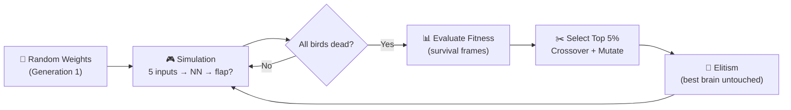
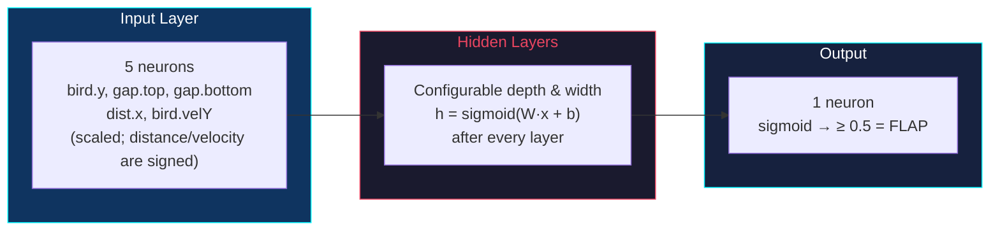

# Flappy Bird AI — Neuroevolution from Scratch

[](https://khuongngoduc0310.github.io/Flappy-Bird-with-Neural-Network)
[](https://react.dev)
[](https://p5js.org)
[](LICENSE)

**1,000 birds learn to play Flappy Bird through neuroevolution. No TensorFlow. No PyTorch. Just custom matrix math, a feedforward neural network built from scratch, and a genetic algorithm.**

---

## System Overview



---

## Neural Network Architecture



- **5 scaled inputs** (position, gap geometry, horizontal distance, velocity) feed through configurable hidden layers. Position and gap values are generally 0–1; distance and velocity remain signed and can fall outside that range.
- **Sigmoid activation** applied after *every* layer — not just the output — preventing the network from collapsing to a linear transform
- **Binary decision**: output ≥ 0.5 triggers `bird.flap()`, otherwise do nothing
- Default topology `[5, 1]` can be reconfigured live via the UI (add/remove layers, adjust neurons)

---

## Genetic Algorithm

- **Fitness** = survival frames. Birds that live longer score higher.
- **Selection** — the top 5% survive (with a minimum of two). Two distinct survivors are chosen randomly as parents when possible.
- **Crossover** — uniform random (`P=0.5` per weight from parent A or B) via `Matrix.crossover()`
- **Mutation** — Gaussian noise `N(0, strength)` applied with probability `rate` via `Matrix.generateMutation()`
- **Elitism** — the single best brain is copied unchanged into the next generation. Its measured fitness can still vary because pipe layouts are randomized.
- **Champion Brain persistence** — after any generation completes, save the best brain to localStorage via the 💾 Save Brain button. Load it later with 📂 Load Champion to seed a new simulation, or 🗑️ Clear Saved to remove it.
- Entire cycle runs automatically — just click **RESTART SIMULATION** and watch the score curve climb

## Simulation Controls

### Pause / Resume

The **PAUSE / RESUME** button (overlaid on the game canvas) controls the p5.js draw loop without resetting any simulation state. When paused:

- The current generation, bird positions, pipe layout, frame counter, and generation history are **all preserved**.
- The neural network training loop is suspended — no ticks are processed.
- Clicking **RESUME** continues from exactly where the simulation stopped.
- Toggling pause does **not** call `onGenerationEnd(null)` (it does not clear history).

### Parameter Changes

All hyperparameters in the **Configuration** sidebar (number of birds, mutation rate, mutation strength, ticks per frame, and brain dimensions) are tracked via serialized key comparison. Clicking **RESTART SIMULATION** reinitializes birds, pipes, the generation counter, and history only when a submitted value has actually changed; unchanged submissions are ignored.

This means:
- Changing `numOfBirds`, `mutationRate`, `mutationStrength`, `ticksPerFrame`, or `brainDimensions` → simulation **restarts**.
- Loading a saved champion brain → simulation **restarts** (dimensions are updated to match the champion).
- Toggling pause → simulation **does not restart**.

### Keyboard Shortcut

Pressing **R** or **r** while the application is focused triggers the same reset behavior as clicking the **RESET TRAINING** button:

- Clears the generation history and best-brain state.
- Resets the latest score reference.
- Increments the restart counter, which reinitializes the p5.js simulation.

The shortcut is ignored when focus is inside an input, textarea, select, or contenteditable element, so parameter entry is never disrupted.

Pressing **K** or **k** decreases the simulation speed by 1 (minimum 1×), and pressing **L** or **l** increases it by 1 (maximum 20×). Speed changes take effect immediately without restarting the simulation or clearing generation history. These shortcuts are also ignored inside editable controls.

### Champion Brain Controls

The **Champion Brain** panel provides three actions:
| Action | Behavior |
|--------|----------|
| 💾 **Save Brain** | Persists the best brain from the latest generation to `localStorage`. Automatically saves when a new high score is achieved. |
| 📂 **Load Champion** | Validates that the saved network has five inputs, one output, positive integer layer sizes, finite parameters, and consistent matrices. A valid load adopts the champion's hidden-layer architecture, restarts the simulation, seeds the first bird exactly, and creates mutated variants for the rest. |
| 🗑️ **Clear Saved** | Removes the saved champion data from `localStorage`. |

---

## Project Structure

| Module | Role |
|--------|------|
| `src/NeuralNet/` | Custom ML engine: `Matrix` (dot, add, map, crossover, gaussian), `Layer`, `NeuralNetwork` (predict, copy, mutate, crossover) — zero external ML dependencies |
| `src/objects/` | Game entities: `Bird` (physics, flap, cached input array), `Pipe` (spawning, scrolling, gap generation) |
| `src/sketches/` | p5.js loop: simulation, collision, GA breeding, `ticksPerFrame` acceleration, real-time NN weight visualization |
| `src/components/` | React UI: `ParameterForm` (hyperparameter sliders), `FitnessChart` (SVG score vs. generation), `P5Wrapper` (React ↔ p5 bridge) |

**Champion persistence:** After a generation finishes, the champion brain (serialized layers, weights, and biases) and its finite score can be saved to browser localStorage. Loading a saved champion restarts the simulation with the first bird receiving an exact copy of that brain and the rest receiving mutated variants. Brain and score metadata are validated together, so corrupt data cannot enable loading or block later auto-saves with a stale score. Legacy valid brains without score metadata remain loadable and start with no score threshold.

**Performance:** Up to 20 simulation ticks per rendered frame (60 FPS rendering, up to 1,200 ticks/s). Input arrays are pre-allocated per bird — no per-frame garbage collection. Collision checked only against the active pipe.

---

## Quick Start

```bash
git clone https://github.com/khuongngoduc0310/Flappy-Bird-with-Neural-Network.git
cd Flappy-Bird-with-Neural-Network
npm install && npm start
```

Open `http://localhost:3000`. Tune mutation rate, strength, hidden layers, and simulation speed from the sidebar. The fitness chart tracks progress in real-time.

After at least one generation completes, you can **save** the best brain for later use, **load** a previously saved champion to restart with its knowledge, or **clear** saved data — all from the Champion Brain section in the sidebar.

---

## Tech Stack

**React 18** · **p5.js** · **@p5-wrapper/react** · **JavaScript ES6+** · **GitHub Pages**

---

## License

[MIT](LICENSE)
