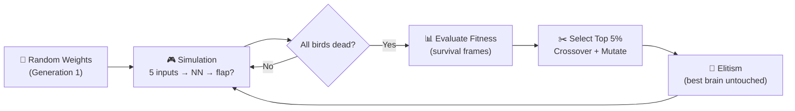
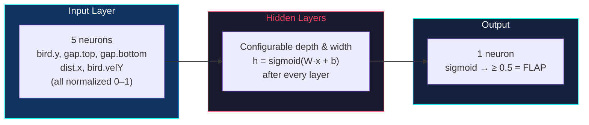

# Flappy Bird AI — Neuroevolution from Scratch

[](https://khuongngoduc0310.github.io/Flappy-Bird-with-Neural-Network)
[](https://react.dev)
[](https://p5js.org)
[](LICENSE)

**1,000 birds learn to play Flappy Bird through neuroevolution. No TensorFlow. No PyTorch. Just custom matrix math, a feedforward neural network built from scratch, and a genetic algorithm.**

---

## System Overview



---

## Neural Network Architecture



- **5 normalized inputs** (position, gap geometry, velocity) feed through configurable hidden layers
- **Sigmoid activation** applied after *every* layer — not just the output — preventing the network from collapsing to a linear transform
- **Binary decision**: output ≥ 0.5 triggers `bird.flap()`, otherwise do nothing
- Default topology `[5, 1]` can be reconfigured live via the UI (add/remove layers, adjust neurons)

---

## Genetic Algorithm

- **Fitness** = survival frames. Birds that live longer score higher.
- **Selection** — top 5% survive. Survivors are chosen randomly as parents.
- **Crossover** — uniform random (`P=0.5` per weight from parent A or B) via `Matrix.crossover()`
- **Mutation** — Gaussian noise `N(0, strength)` applied with probability `rate` via `Matrix.generateMutation()`
- **Elitism** — the single best brain is copied unchanged into the next generation, guaranteeing fitness never regresses
- Entire cycle runs automatically — just click **RESTART SIMULATION** and watch the score curve climb

---

## Project Structure

| Module | Role |
|--------|------|
| `src/NeuralNet/` | Custom ML engine: `Matrix` (dot, add, map, crossover, gaussian), `Layer`, `NeuralNetwork` (predict, copy, mutate, crossover) — zero external ML dependencies |
| `src/objects/` | Game entities: `Bird` (physics, flap, cached input array), `Pipe` (spawning, scrolling, gap generation) |
| `src/sketches/` | p5.js loop: simulation, collision, GA breeding, `ticksPerFrame` acceleration, real-time NN weight visualization |
| `src/components/` | React UI: `ParameterForm` (hyperparameter sliders), `FitnessChart` (SVG score vs. generation), `P5Wrapper` (React ↔ p5 bridge) |

**Performance:** Up to 20 simulation ticks per rendered frame (60 FPS rendering, up to 1,200 ticks/s). Input arrays are pre-allocated per bird — no per-frame garbage collection. Collision checked only against the active pipe.

---

## Quick Start

```bash
git clone https://github.com/khuongngoduc0310/Flappy-Bird-with-Neural-Network.git
cd Flappy-Bird-with-Neural-Network
npm install && npm start
```

Open `http://localhost:3000`. Tune mutation rate, strength, hidden layers, and simulation speed from the sidebar. The fitness chart tracks progress in real-time.

---

## Tech Stack

**React 18** · **p5.js** · **@p5-wrapper/react** · **JavaScript ES6+** · **GitHub Pages**

---

## License

[MIT](LICENSE)
